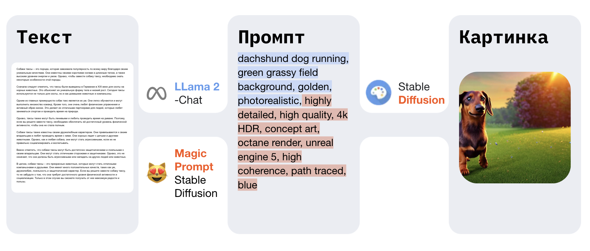

# Imaginarium AI
A service for image generation without prompt engineering.

## Pipeline


## How To Deploy

### Clone repo to server
```
richie@gur:~$ git clone https://github.com/vilovnok/hackathon
```
## The first way
### Run application from docker-compose.yaml
```
richie@gur:~$ docker-compose up  
``` 

## The second way 
### Run application from root folder service
```
richie@gur:~$ cd service/ 
richie@gur:~$ ng serve 
```
### Install requirements.txt from root folder /restapi/
```
richie@gur:~$ pip3 install -r requirements.txt
```
### Run application from root folder /restapi/src/
```
richie@gur:~$ cd /restapi/src/
richie@gur:~$ uvicorn main:app --port 8000 --reload 
richie@gur:~$ celery --app=main.celery worker --loglevel=info"   
```
